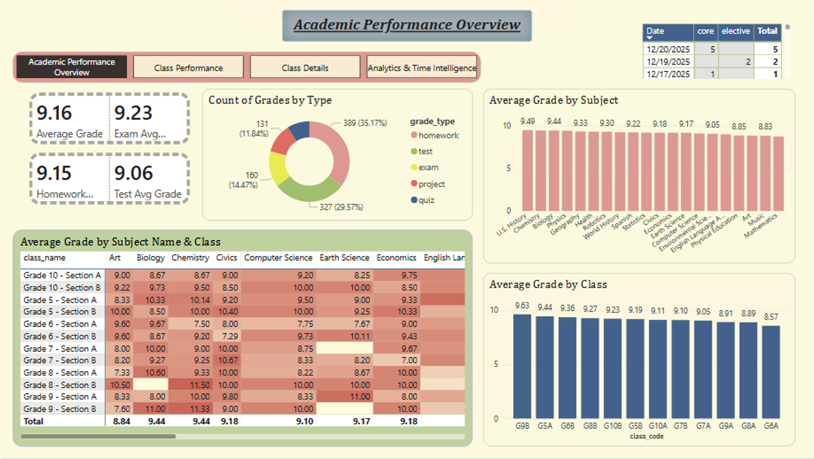
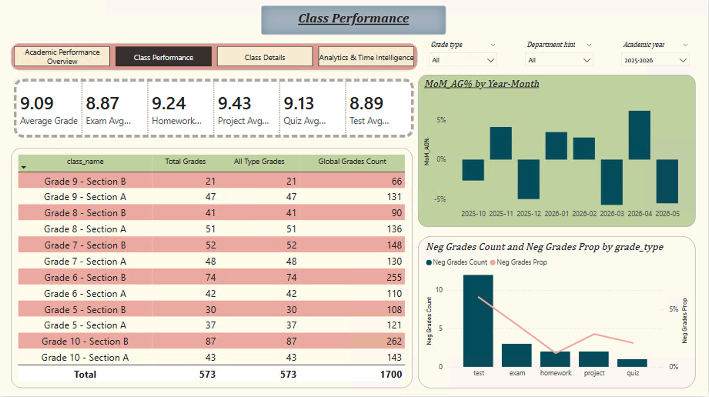
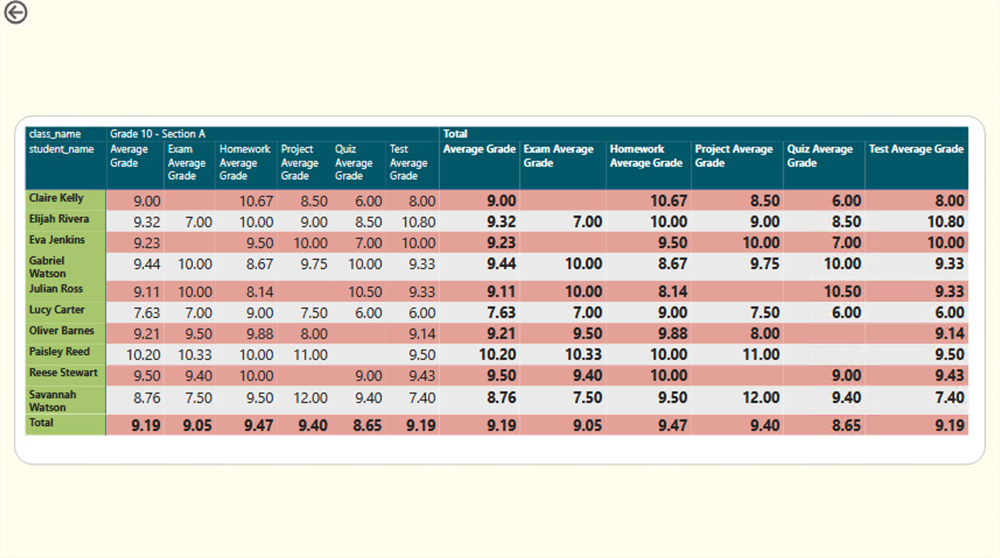
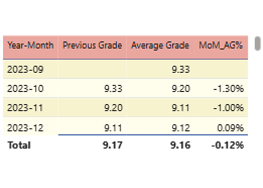
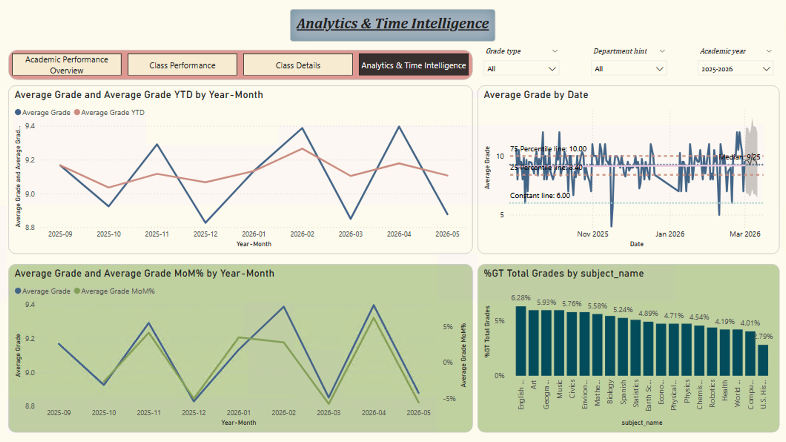

# Academic Performance Dashboard | Power BI

Interactive Power BI dashboard for analyzing academic performance across students, classes, subjects, teachers, assessment types, and academic periods.

## Project Overview

This project simulates a real-world data analyst task for a school implementing an electronic grading system.

The goal was to transform raw CSV data from different sources into a reliable analytical model and build an interactive Power BI report for analyzing academic performance, comparing classes and subjects, monitoring negative grades, and tracking performance trends over time.

The project covers the full analytical workflow — from raw data import and cleaning to data modeling, DAX measures, Time Intelligence, interactive visualizations, drill-through, and tooltip analysis.

## Business Questions

The dashboard is designed to answer questions such as:

- What is the average academic performance across the school?
- How does performance vary by class and subject?
- How do grades differ across assessment types?
- How frequently do negative grades occur?
- How does academic performance change over time?
- Which classes and students require deeper analysis?
- How can monthly changes in average grade be monitored?

## Data Source

The analysis uses six CSV files representing an electronic school grading system:

| Table | Description |
| --- | --- |
| `grades.csv` | Fact table containing grade records, dates, grade values, assessment types, and foreign keys |
| `students.csv` | Student information including class, gender, enrollment data, and location |
| `classes.csv` | Class information including grade level, section, and class teacher |
| `teachers.csv` | Teacher information including department and hire date |
| `subjects.csv` | Subject information including subject name and subject type |
| `periods.csv` | Academic periods including academic year, term, and period dates |
| `calendar` | DAX-generated date dimension used for time-based analysis |

## Process

### 1. Data Import

Imported all source CSV files into Power BI Desktop.

### 2. Data Cleaning & Transformation

Used **Power Query** to prepare the raw data:

- Corrected data types for text, numeric, and date fields
- Standardized dates using the appropriate `en-US` locale
- Converted `grade_value` from text to numeric format
- Checked and handled incorrect or missing values
- Validated primary and foreign keys
- Checked critical fields for blanks and duplicates
- Filtered incomplete `grade_type` values where required

### 3. Calendar & Time Dimension

Created a dedicated calendar table using **DAX** with Date, Year, Month, Month Number, and Year-Month attributes.

The calendar is connected to `grades[grade_date]` and is used for time-based analysis and Time Intelligence calculations.

### 4. Data Modeling

Built a **Star Schema** with `grades` as the central fact table and separate dimension tables for students, classes, teachers, subjects, periods, and calendar.

Main relationships use **One-to-Many** cardinality with **Single-direction filtering** to ensure reliable filter propagation.

## DAX & Measures

Created a dedicated `_Measures` table to organize report measures.

Key calculations include:

- Average Grade
- Exam Average Grade
- Homework Average Grade
- Project Average Grade
- Quiz Average Grade
- Test Average Grade
- Total Grades
- All Type Grades
- Global Grades Count
- Negative Grades Count
- Negative Grades Proportion
- Previous Grade
- Month-over-Month Average Grade Change (`MoM_AG%`)
- Year-to-Date Average Grade (`YTD`)

Measures were designed to behave correctly under different filter contexts and visual interactions.

## Dashboard Pages

The report contains five analytical pages:

### Academic Performance Overview


High-level overview of academic performance with KPI cards, subject and class comparisons, grade trends, assessment-type distribution, and interactive filtering.

### Class Performance

Class-level performance analysis including assessment-specific averages, grade counts by class, negative grades by assessment type, negative grade percentage, month-over-month performance change, and slicers for `grade_type`, `academic_year`, and `department_hint`.

### Class Details (Drill-through)

A dedicated **drill-through** page for student-level analysis, showing class and student performance across overall and assessment-specific grade measures.

### MoM%_AG_details (Report Tooltip)



### Analytics & Time Intelligence


Advanced analysis of academic performance over time, including:

- Average Grade timeline
- 25th percentile
- Median
- 75th percentile
- Reference line at grade 6
- Trend line
- Forecast with 95% confidence interval
- Grade share by subject
- YTD analysis
- Previous-period difference analysis

## Time Intelligence

### Year-to-Date Analysis

Created a YTD calculation based on `Average Grade` and `calendar[Date]`.

The manually defined DAX calculation was compared with Power BI's Quick Measure implementation to validate that both approaches return matching results.

### Month-over-Month Analysis

Calculated the change in average grade compared with the previous period to highlight positive and negative monthly movements.

### Forecast & Trend Analysis

The Analytics & Time Intelligence page uses Power BI analytical features to examine historical performance, identify trends, and generate short-term forecasts with a 95% confidence interval.

## Interactive Features

- Page-level filters
- Interactive slicers
- Cross-filtering
- Drill-through navigation
- Report tooltips
- Navigation buttons
- Preserved filter context
- Controlled visual interactions
- Drill-down and drill-up functionality

## Data Quality

Before building the final model, the data was validated through:

- Primary key uniqueness checks
- Foreign key validation
- Missing value checks
- Duplicate detection
- Date format validation
- Numeric conversion validation
- Blank category handling
- Relationship validation

## Dashboard Design

All report pages follow a consistent visual system:

- Consistent color palette
- Standardized KPI cards
- Consistent typography
- Aligned visual blocks
- Consistent slicer and button styling
- Structured page layout
- Consistent navigation

The report follows a repeatable layout:

```text
Header
  ↓
Navigation + Filters
  ↓
KPI Section
  ↓
Analytical Visualizations
  ↓
Detailed Analysis
```

## Tools & Technologies

- **Power BI Desktop** — dashboard development and reporting
- **Power Query** — data cleaning and transformation
- **DAX** — calculated columns, measures, and Time Intelligence
- **Data Modeling** — Star Schema and relationship management
- **CSV** — raw data sources
- **GitHub** — project documentation and version control

## Skills Demonstrated

- Data cleaning and transformation
- Power Query
- DAX
- Star Schema data modeling
- Fact and dimension table design
- Relationship management
- Data quality validation
- KPI development
- Interactive dashboard design
- Time Intelligence
- YTD analysis
- Month-over-month analysis
- Statistical analysis
- Forecasting
- Drill-through
- Report tooltips
- Cross-filtering
- Dashboard navigation
- Data storytelling

## Project Outcome

Built a multi-page Power BI report that transforms raw school grading data into a structured analytical model and interactive BI product.

The project demonstrates the ability to work across the complete BI workflow: preparing raw data, validating data quality, designing a Star Schema, developing DAX measures, applying Time Intelligence, and delivering an interactive report for multi-level performance analysis.

## Author

**Anastasiia Orlova**  
Data Analyst

- [GitHub](https://github.com/anastasiiaorlova23)
